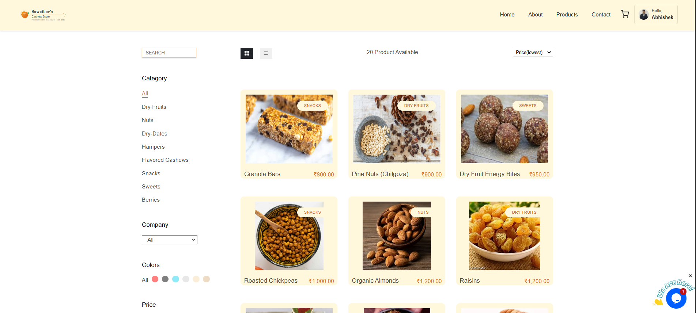
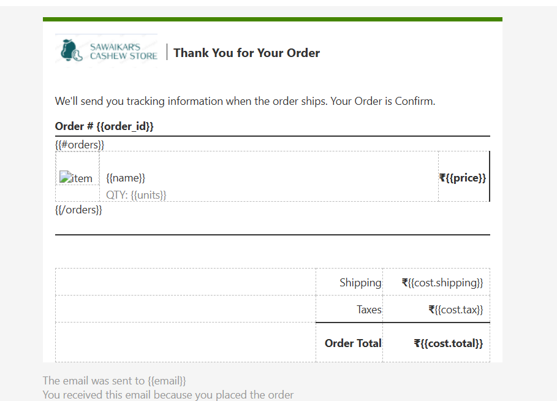
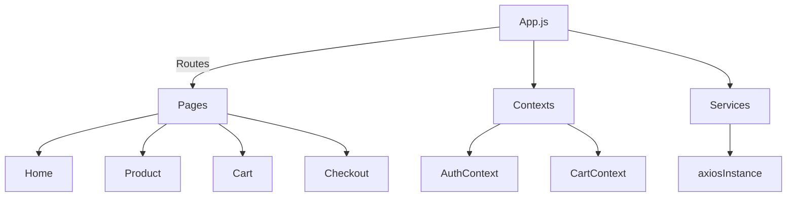

# 🥜 Cashew E-Commerce Store


> A modern single-page application that powers an online cashew nuts shop ‑ built with React, Auth0, and Netlify.

[🌐 **Live Demo**](https://sawaikar-s-cashew-store.vercel.app/) · [📺 Video Walk-through](#) · [🐞 Report Bug](https://github.com/your-fork/issues)

---

## 📜 Table of Contents
1. [Features](#features)
2. [Screenshots](#screenshots)
3. [Architecture](#architecture)
4. [Tech Stack](#tech-stack)
5. [Folder Structure](#folder-structure)
6. [Getting Started](#getting-started)
7. [Available Scripts](#available-scripts)
8. [Environment Variables](#environment-variables)
9. [Deployment](#deployment)
10. [Contributing](#contributing)
11. [License](#license)
12. [Author](#author)

---

## ✨ Features

- **Product Catalogue** – list & grid views, category filter, price sorting.
- **Product Details** – zoomable gallery, nutrition facts, related products.
- **Shopping Cart** – mini-cart dropdown, quantity adjust, subtotal calc.
- **Checkout Flow** – guarded by Auth0 login, address & payment steps.
- **Order QR Code** – generate QR for UPI / payment link.
- **Search** – fuzzy search bar (client side).
- **Responsive UI** – mobile-first; Flexbox & CSS-grid via styled-components.
- **Dark / Light Theme** – persisted preference in `localStorage`.
- **Contact Form** – serverless email via EmailJS.
- **PWA** – installable and offline-ready (service worker).

## 🖼️ Screenshots
| Home | Product Page | Cart |
| ---- | ------------ | ---- |
| .png) |  |  |

> **Note:** Images are stored in `Assets/screens/`. Replace with yours if cloning.

## 🏗️ Architecture



* **State Management:** React Context API (`AuthContext`, `CartContext`).
* **Routing:** React Router v6 with nested routes & lazy-loading.
* **API Layer:** Axios instance with base URL & interceptors.
* **Styling:** `styled-components` + global style & theme provider.

## 🛠️ Tech Stack

| Category       | Tech                                                     |
| -------------- | -------------------------------------------------------- |
| Front-end      | React 18, React Router 6, styled-components              |
| Auth           | Auth0 SPA SDK (`@auth0/auth0-react`)                     |
| State / Utils  | Context API, `qrcode.react`, `react-icons`               |
| Forms / Email  | `@emailjs/browser`                                       |
| Tooling        | create-react-app 5, ESLint, Prettier                     |
| Deployment     | Netlify CI/CD, Netlify Forms, Netlify Redirects          |

## 📂 Folder Structure

```
├─ public/
│  └─ index.html            # CRA template
├─ src/
│  ├─ assets/               # Images & icons
│  ├─ components/           # UI building blocks (Navbar, Button, ...)
│  ├─ context/              # Auth & Cart providers
│  ├─ hooks/                # Custom React hooks
│  ├─ pages/                # Route components (Home, Product, Cart…)
│  ├─ services/             # API wrappers (products, orders)
│  ├─ styles/               # GlobalStyle & theme
│  ├─ utils/                # Helper functions
│  ├─ App.js                # Entry w/ routes
│  └─ index.js              # ReactDOM render
└─ .env.example             # Sample env vars
```

## 🚀 Getting Started

### Prerequisites
* **Node.js ≥ 16**
* **npm ≥ 8**

### Installation
```bash
git clone https://github.com/<your-fork>/cashew-store.git
cd cashew-store
npm install
npm start
```
Visit `http://localhost:3000`.

## 🏃‍♂️ Available Scripts
| Script        | Description                          |
| ------------- | ------------------------------------ |
| `npm start`   | Run dev server w/ hot reload         |
| `npm run build` | Production build to `/build`        |
| `npm test`    | Launch Jest + React Testing Library  |
| `npm run lint`| Run ESLint                           |

## 🔐 Environment Variables
Create a `.env` at project root:
```
REACT_APP_AUTH0_DOMAIN=yourdomain.us.auth0.com
REACT_APP_AUTH0_CLIENT_ID=xxxx
REACT_APP_EMAILJS_PUBLIC_KEY=xxxx
REACT_APP_EMAILJS_SERVICE_ID=xxxx
REACT_APP_EMAILJS_TEMPLATE_ID=xxxx
```

## 🚢 Deployment
The site is auto-deployed via Netlify on every push to `main`.
1. `npm run build`
2. Drag the `build/` folder to Netlify or connect the repo.

## 🤝 Contributing
1. Fork & create a new branch: `git checkout -b feat/awesome`  
2. Make changes + tests.  
3. Commit: `git commit -m "feat: awesome"`  
4. Push & open a PR.

## 📄 License
Released under the **MIT License**.

## 👨‍💻 Author
**Abhishek Kumar**  
[LinkedIn](https://www.linkedin.com/in/abhishek-kumar) • [Twitter](https://twitter.com/abhishek)

Enjoy shopping for the finest cashews! 🥳

A full-featured e-commerce web application for an online cashew shop built with **React 18** and the modern React ecosystem. Customers can browse a rich product catalogue, add items to a shopping cart, and complete purchases – all from any device.

[Live Demo ↗](https://sawaikarcashewstore.netlify.app)

---

## ✨ Key Features

1. **Product catalogue** – dynamic list/grid views with filtering & sorting.
2. **Product detail pages** – high-resolution images, descriptions & nutritional facts.
3. **Shopping cart & mini-cart** – add / remove / update quantities, persistent in localStorage.
4. **Secure user authentication** – Social & email login via **Auth0**.
5. **Protected routes** – cart & checkout guarded behind login using React Router v6.
6. **Responsive design** – mobile-first layouts styled with **styled-components**.
7. **Contact / feedback form** – serverless email sending via **EmailJS**.
8. **Order QR code** – generates QR codes (‵qrcode.react‵) for quick payment scanning.
9. **REST API integration** – product & order data fetched with **Axios**.
10. **Progressive Web App** – installable, offline support by CRA service-worker (build).

---

## 🛠️ Tech Stack

| Layer            | Libraries / Tools                                  |
| ---------------- | --------------------------------------------------- |
| Front-end        | React 18, React Router 6, styled-components         |
| Auth             | @auth0/auth0-react                                 |
| Network          | Axios                                              |
| UI Icons         | react-icons                                        |
| Forms / Email    | @emailjs/browser                                   |
| QR Code          | qrcode.react                                       |
| Build / Tooling  | create-react-app 5, ESLint, Prettier               |
| Deployment       | Netlify (CI & HTTPS)                               |

---

## 📂 Folder Structure (important paths)

```text
E-Commerce-Website-using-React-Js-main/
├─ public/               # Static assets & CRA template
├─ src/
│  ├─ components/        # Reusable UI components (Navbar, Footer, etc.)
│  ├─ pages/             # Route pages (Home, Product, Cart, Checkout)
│  ├─ context/           # Global state providers (Auth, Cart)
│  ├─ hooks/             # Custom React hooks
│  ├─ services/          # API helpers (axios instances)
│  ├─ styles/            # Shared styled-components & theme
│  └─ App.js             # App entry & route configuration
└─ README.md
```

---

## 🚀 Getting Started

### Prerequisites

* Node.js ≥ 16
* npm ≥ 8 (comes with Node)

### Installation

```bash
# 1. Clone the repo
git clone https://github.com/<your-fork>/E-Commerce-Website-using-React-Js.git
cd E-Commerce-Website-using-React-Js-main

# 2. Install dependencies
npm install

# 3. Start the development server
npm start
```
The app will open at `http://localhost:3000` and reload on code changes.

### Build for Production

```bash
npm run build
```
The optimized build is output to `build/` and ready for deployment (already deployed on Netlify).

### Environment Variables

Create a `.env` file at the project root with your own keys:

```env
REACT_APP_AUTH0_DOMAIN=xxxxxxxx.us.auth0.com
REACT_APP_AUTH0_CLIENT_ID=xxxxxxxxxxxxxxxxxxxxx
REACT_APP_EMAILJS_PUBLIC_KEY=xxxxxxxxxxxxxxxxx
REACT_APP_EMAILJS_SERVICE_ID=service_xxxxx
REACT_APP_EMAILJS_TEMPLATE_ID=template_xxxxx
```

> ⚠️ Never commit real secrets – use environment variables or Netlify UI.

---

## 🧑‍💻 Contributing

Pull requests are welcome! Feel free to open issues for bugs or feature requests.

1. Fork the project & create your branch: `git checkout -b feature/awesome`  
2. Commit your changes: `git commit -m "feat: add awesome"`  
3. Push to the branch: `git push origin feature/awesome`  
4. Open a Pull Request

---

## © License

This project is released under the **MIT License**.

---

### Author

**Abhishek Kumar** – [LinkedIn](https://www.linkedin.com/in/abhishek-kumar)

Enjoy the cashew shopping experience! 🥜🎉
